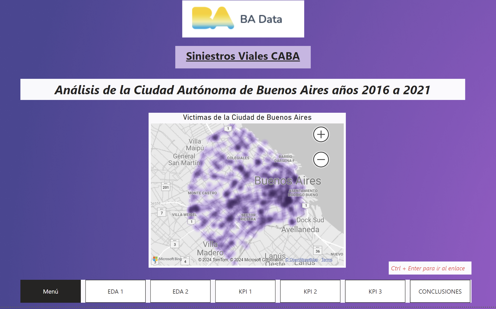
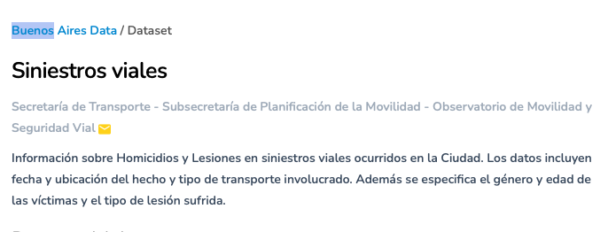
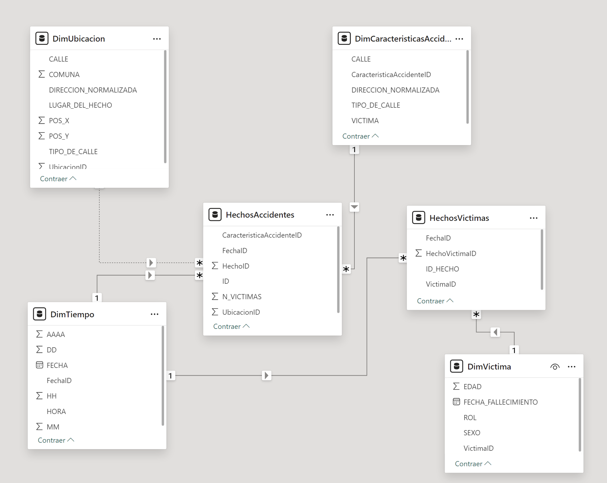
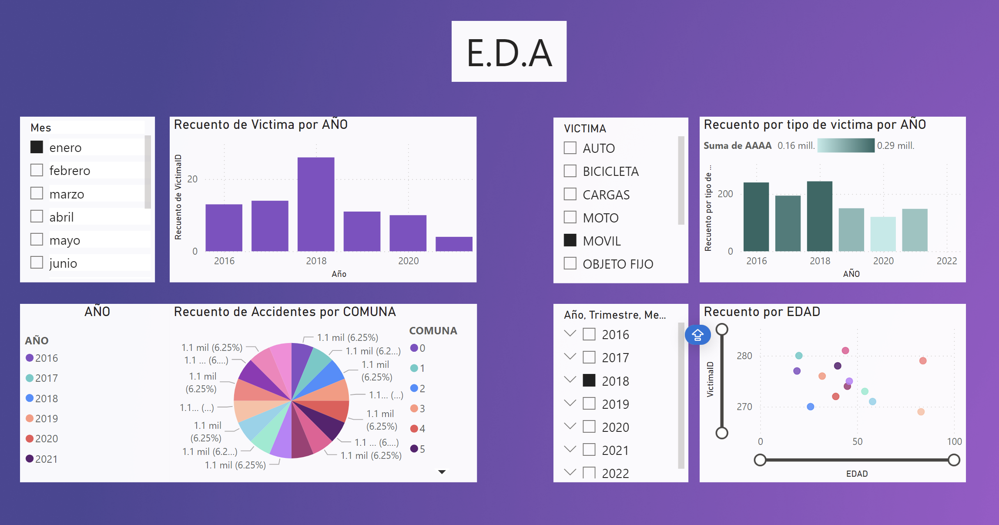

# Análisis de Siniestros Viales en CABA

Este proyecto se enfoca en el análisis de siniestros viales en la Ciudad Autónoma de Buenos Aires (CABA) con el objetivo de monitorear y reducir la tasa de homicidios en accidentes de tránsito y otros indicadores clave relacionados. Utilizando herramientas de visualización de datos como Power BI, análisis de datos en Python y almacenamiento, organizacion y acceso a información de manera segura y confiable en MySQL, buscamos obtener insights valiosos y establecer métricas de rendimiento clave (KPIs) para la gestión y prevención de accidentes.

### Estructura del Proyecto
El proyecto está organizado en varias partes, cada una con su propia funcionalidad y propósito. A continuación, se detallan las principales secciones del repositorio:

### Datasets: 

El gobierno de la Ciudad de Buenos Aires, en su direccion web: https://data.buenosaires.gob.ar/dataset/victimas-siniestros-viales, nos permite bajar a nuestra pc un dataset basado en un excel con varias solapas, la mas importantes son Hechos y Victimas.

[Datasets_Originales](Datasets_originales)

### ETL 

El proceso de transformarcion no fue demasiado laborioso, ya que las tablas estaban bastante bien, el CRITERIO PRINCIPAL FUE MANTENER TODAS LAS FILAS, dado el contenido sensible de las mismas, cabe destacar que el string 'SD',que significa sin datos aparecia en muchas columnas y en el caso de la columna HH(banda horaria)nos creo tal conflicto que fue la unica fila que decidimos borrarla, con el resto de otras columnas hemos dejado el dato tal cual para tener idea del progreso en el registro y documentacion con el transcurrir del tiempo.

[Datasets Limpios](ETL)

### Estructura de las Tablas

Como parte del trabajo realizado, dividimos las tablas de `Hechos` y `Víctimas` originales en cuatro tablas de dimensión y dos tablas de hechos para mejorar la organización y eficiencia del análisis de datos. A continuación se describen las características principales de estas tablas:

#### Tablas de Dimensión

1. **DimTiempo**
   - **Columnas:** `FechaID`, `FECHA`, `AAAA`, `MM`, `DD`, `HORA`, `HH`
   - **Descripción:** Proporciona información detallada sobre las fechas y tiempos asociados con los siniestros viales.

2. **DimUbicacion**
   - **Columnas:** `UbicacionID`, `LUGAR_DEL_HECHO`, `TIPO_DE_CALLE`, `CALLE`, `DIRECCION_NORMALIZADA`, `COMUNA`, `POS_X`, `POS_Y`
   - **Descripción:** Contiene datos sobre las ubicaciones donde ocurrieron los siniestros, incluyendo coordenadas geográficas y detalles de la calle.

3. **DimCaracteristicasAccidente**
   - **Columnas:** `CaracteristicaAccidenteID`, `TIPO_DE_CALLE`, `CALLE`, `DIRECCION_NORMALIZADA`
   - **Descripción:** Incluye información sobre las características específicas de los accidentes, como el tipo de calle y la dirección normalizada.

4. **DimVictima**
   - **Columnas:** `VictimaID`, `ROL`, `SEXO`, `EDAD`, `FECHA_FALLECIMIENTO`
   - **Descripción:** Proporciona detalles sobre las víctimas de los siniestros, incluyendo su rol en el accidente, género, edad y fecha de fallecimiento (si aplica).

#### Tablas de Hechos

1. **HechosAccidentes**
   - **Columnas:** `HechoID`, `ID`, `N_VICTIMAS`, `FechaID`, `UbicacionID`, `CaracteristicaAccidenteID`
   - **Descripción:** Contiene datos sobre los accidentes, incluyendo el número de víctimas, la fecha del accidente y referencias a las dimensiones de ubicación y características del accidente.

2. **HechosVictimas**
   - **Columnas:** `HechoVictimaID`, `ID_HECHO`, `FechaID`, `VictimaID`
   - **Descripción:** Detalla las víctimas involucradas en cada accidente, asociando cada hecho con las dimensiones de tiempo y víctimas.

Estas tablas asi organizadas permiten un análisis más eficiente y detallado de los datos de siniestros viales en CABA, facilitando y economizando 'costo computacional' a la hora de hacer las consultas en la creación de visualizaciones y KPIs en Power BI.

[Dimensiones](dimensiones)

### Pasar los datos a MySQL:

Creación y llenado de tablas MySQL con Python: Se automatizó la creación de tablas MySQL utilizando Python y se poblaron las tablas con los datos.

[Insersion en MySQL](MySQL)

### Scripts de Análisis
análisis_kpis.py: Script en Python para el cálculo de los KPIs definidos en el proyecto.

merge_datasets.py: Script en Python para unir las tablas necesarias para el análisis.

[KPI_en_Python](kpi)

### Archivos de Power BI

##### A lo largo de los codigos vemos mucho la palabra 'tableau' ya que hera el programa elegido para realizar las graficas, ya que nos encontramos trabajando en Mac, sin embargo, nos encontramos con el problema que en su version gratuita no dispone de la importacion a MySQL, ni tampoco de trabajar con varios datasets... por lo que decidimos pasar todo el trabajo a Power BI, aca pasamos el archivo donde extrajimos las tablas de MySQL, transformandolas en csv.

Vale aclarar tambien que, como hemos dicho que estamos trabajando en Mac, tuvimos que instalar una VM a traves de Parallels para acceder a Power BI, dicho esto, es importante entender que la propia Mac(donde esta la BBDD) toma a la VM como otra 'maquina', y los sistemas de seguridad que se debe desbloquear son muy largos y extensos, por una cuestion de tiempo no lo hemos podido realizar, quiero decir, la importacion de los archivos desde MySQL a Power BI,por lo que directamente sacamos los archivos de las tablas de la BBDD, exportando a csv para colocarlas en Power BI, luego, por una cuestion de 'conexiones' decidimos dejar los nombres tal cual para no crear conflictos

[Exportacion_desde_MySQL](exportar_csv_desde_mysql)

Analisis_Siniestros_Viales.pbix: Archivo de Power BI con las visualizaciones y análisis.

KPIs Definidos

#### Reducir en un 10% la tasa de homicidios en siniestros viales en los últimos seis meses en comparación con el semestre anterior.

Fórmula: (Número de homicidios en siniestros viales / Población total) * 100,000

Población de referencia: 3,075,646 (CABA).

#### Reducir en un 7% la cantidad de accidentes mortales de motociclistas en el último año en comparación con el año anterior.

#### Proponer y monitorear un KPI adicional: 

Reducir en un 5% la cantidad de accidentes en una determinada área geográfica específica en CABA respecto al año anterior.

Área de referencia: Comuna 1.

Visualizaciones en Power BI

1. Gráfico de Línea: Tasa de Homicidios en Siniestros Viales
 
Descripción: Evolución de la tasa de homicidios en siniestros viales a lo largo del tiempo.

2. Gráfico de Barras: Número de Accidentes Mortales de Motociclistas por Año
   
Descripción: Número de accidentes mortales de motociclistas por año.

3. Gráfico de Columnas: Número de Accidentes por Comuna
   
Descripción: Número de accidentes por comuna.

4. Gráfico de Dispersión: Relación entre Edad y Número de Homicidios
   
Descripción: Relación entre el número de homicidios y la edad de las víctimas.

#### Contribución

Si deseas contribuir a este proyecto, por favor sigue los siguientes pasos:

Realiza un fork del repositorio.

Crea una nueva rama (git checkout -b feature/nueva-funcionalidad).

Realiza tus cambios y confirma los cambios (git commit -am 'Agrega nueva funcionalidad').

Sube la rama (git push origin feature/nueva-funcionalidad).

Abre un Pull Request.

#### Contacto

Para cualquier consulta o sugerencia, por favor contacta a cerelliluisalberto@gmail.com
